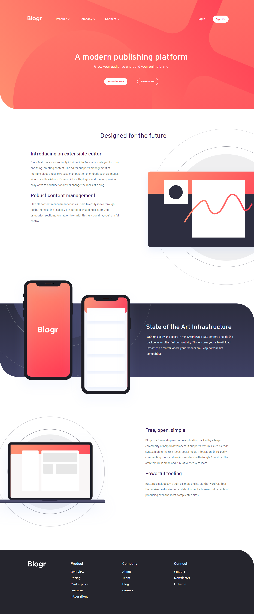

# Frontend Mentor - Blogr landing page solution

This is a solution to the [Blogr landing page challenge on Frontend Mentor](https://www.frontendmentor.io/challenges/blogr-landing-page-EX2RLAApP). Frontend Mentor challenges help you improve your coding skills by building realistic projects. 

## Table of contents

- [Overview](#overview)
  - [The Challenge](#the-challenge)
  - [Screenshot](#screenshot)
- [My Process](#my-process)
  - [Built with](#built-with)
  - [Continued Development](#continued-development)
- [Author](#author)

## Overview

### The Challenge

Users should be able to:

- View the optimal layout for the site depending on their device's screen size
- See hover states for all interactive elements on the page

### Screenshot

## My Process

### Built with

- Semantic HTML5 markup
- CSS custom properties
- Flexbox
- CSS Grid
- SCSS
- Mobile-first workflow
- Simple JavaScript function for dynamic changes

### Continued Development

The future of this project would consist of including the animation of its containing parts and the addition of dark mode feature.

## Author

- LinkedIn - [@sofskrbic](https://www.linkedin.com/in/sofskrbic)
- Instagram - [@abovetheux](https://www.instagram.com/abovetheux)
- Twitter - [@sofskrbic](https://www.twitter.com/sofskrbic)
